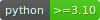

<p align="center">
  
  
</p>

<p align="center">



<a href="https://pypi.org/project/cumulative/"></a>
<a href="/license"></a>

</p>


---

**Cumulative** is an open source project and Python package that provides an intuitive in-memory interface to transform and analyse large collections of time series with composable pipelines.

---

* **Documentation**: [https://elehcimd.github.io/cumulative/](https://elehcimd.github.io/cumulative/)
* **Source code**: [https://github.com/elehcimd/cumulative](https://github.com/elehcimd/cumulative)

---

## Key features

* **Transformations**: Apply vectorized time series transformations as composable pipelines
* **Interoperability**: Access the underlying data at any time as a Pandas data frame
* **Flexibility**: Implement custom transformations and store arbitrary metadata

## Requirements

* **Python >=3.10**

## Installation

```
pip install cumulative
```

## License

This project is licensed under the terms of the [BSD 3-Clause License](https://elehcimd.github.io/cumulative/license/).

